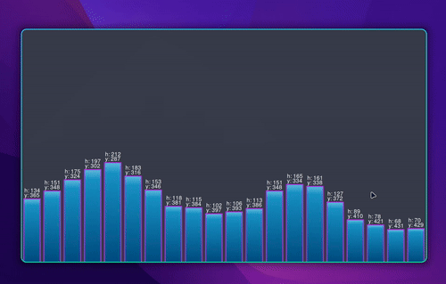

# relm4 cairo - audio visualizer

## demo

This is a simple example of how to use Relm4 to create a simple audio visualizer using cairo drawing.
We use the [cava](https://github.com/karlstav/cava) binary to get the audio data and then we draw it using cairo.

## How to run

- First, you need to install the [cava](https://github.com/karlstav/cava) binary.
- You can then run by using `cargo playground relm4_cairo_visualizer`
